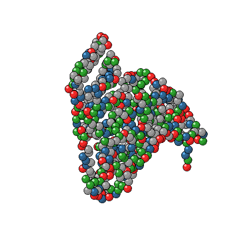
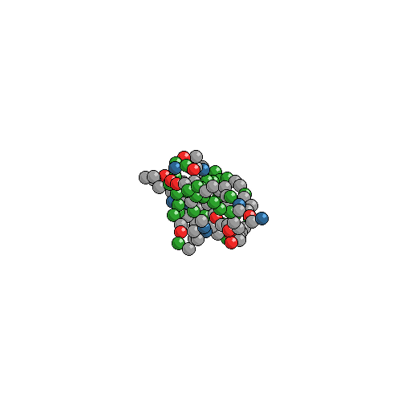

# Protein 2D Projection

This project plots a 2D projection of a protein from an `.xyz` file, placing one colored bead per residue. The background is transparent and the bead size adapts to the size of the box.

---

## How it works

- Reads `.xyz` coordinates
- Recenters by center of mass
- Projects onto XY / XZ / YZ plane
- Colors each residue by category:
  - acidic (Asp, Glu)
  - basic (Lys, Arg, His)
  - polar (Ser, Thr, Asn, Gln, Tyr, Cys, CysDB)
  - apolar (Ala, Val, Leu, Ile, Pro, Phe, Trp, Met, Gly)
- Draws a PNG bead centered on each residue
- Bead size scales according to the box size

---

The code run as following:

`python3 draw-protein-cartoon.py -xyz protein.xyz -plane XY`

## Example Results

   

**Figure 1.** Coarce graned of proteins BSA and 2D5.

